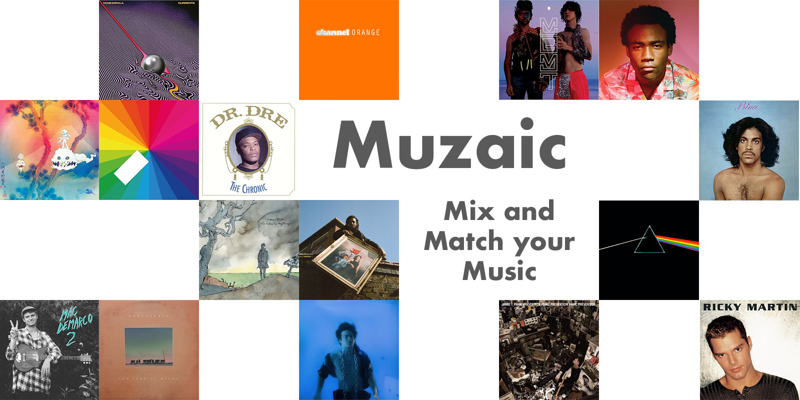
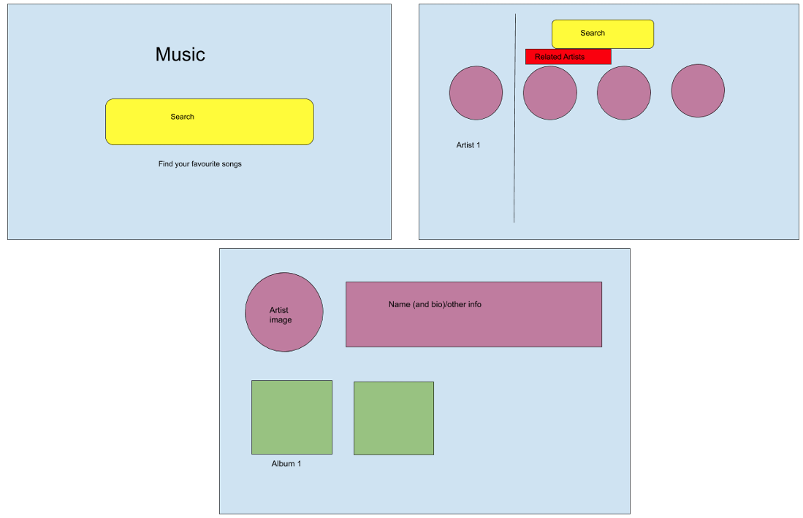

# Muziac: online music discovery platform -  Project 2



This project was a 48 hrs Hackathon, pair-programming activity which I carried out in callaboration with Ali Bhimani.

## Contents

- [Contents](#contents)
- [Brief](#brief)
- [Approach](#approach)
- [Technologies Used](#technologies-used)
- [Wireframe](#wireframe)
- [Responsibilities and Code Review](#responsibilities-and-code-review)
  - [Album](#album)
  - [App](#app)
  - [Naviation Bar](#naviation-bar)
  - [Artist](#artist)
- [Challenges and Key Learnings](#challenges-and-key-learnings)
- [Conclusions](#conclusions)

## Brief

Your application should consume a public API and have several components in the form of website pages. The application should therefore include a router to provide easy access to these pages via a website URLs. Include wireframes that you designed before building the application and ultimately the website should be deployed online and accessible to the public.


## Approach

We initially explored a number of different Public API however the simple documentation and usability of Deezer music API was suitable for our needs. These were important factors as we only had 48 hrs to develop the application. Although sourcing data from elsewhere we wanted to have a unique brand identity. I thought of the name 'Muziac' as a cross between 'music' and 'mozaic'; this was in keeping with the main theme of building an online music discovery website where people can mix and match their music tastes.


## Technologies Used
- JavaScript; React; HTML; CSS
- Bulma; Axios Webpack; React Router Dom


## Wireframe

To aid our front-end logic and distribution of responsibilities, we constructed a wireframe that detailed the user journey.



## Responsibilities and Code Review


### Album

In Album.js the initial  state of the item that was returned was an object of which the key tracks had a value which was the data type object.  Following this to render the information, we map through the array that is within the object.
Writing this code improved my understanding of data structures and retrieving nested data from an API.

  - Code Snippet
``` javascript
  
import React, { useEffect, useState } from 'react'
import ReactAudioPlayer from 'react-audio-player'

const Album = (props) => {
  const [albumsData, updateAlbumsData] = useState({
    title: '',
    tracks: { data: [] }

  })
  useEffect(() => {
    const id = props.match.params.id
    
    fetch(`https://cors-anywhere.herokuapp.com/https://api.deezer.com/album/${id}`)
      .then(resp => resp.json())
      .then((data) => {
        updateAlbumsData(data)
        console.log(data)
      })
  }, [])

```

Link - [Referenced Code](https://github.com/RichardBekoe/Muziac/blob/master/src/Album.js)

### App

In App.js we have too route paths which associate to the same component (i.e. Results Component). This was to enable a different API call which could be made to fetch new data but still using the component structure. In addition, in this file, the NavBar is above the router 'Switch', therefore this component is available on every page.

Link - [Referenced Code](https://github.com/RichardBekoe/Muziac/blob/master/src/App.js)

### Naviation Bar

For the NarBar we implemented code that allowed people to search for artist. We added a template literal to the search endpoint URL. Therefore, the text which the user wrote is added to the search query. 

In our function getFetch a fetch is made to the API. The search box is then reset to empty after the function is run. The use of `withRouter` allowed the information to be returned and made available to different components as props. Depending on the current URL the different URL paths are called, although they map to the same [Results Component](https://github.com/RichardBekoe/Muziac/blob/master/src/Results.js).


``` javascript
import React, { useState } from 'react'
import { Link, withRouter } from 'react-router-dom'
import Logo from './images/muzaic.png'

const NavBar = (props) => {
  const [text, setText] = useState('')
  const search = `https://cors-anywhere.herokuapp.com/https://api.deezer.com/search/artist?q=${text}`
  
  function getFetch(event) {
    event.preventDefault()
    fetch(search)
      .then(resp => resp.json())
      .then(data => {
        console.log(props)
        if (props.location.pathname === '/results') {
          props.history.push({
            pathname: '/resultz',
            state: { data }
          })

        } else {
          props.history.push({
            pathname: '/results',
            state: { data }
          })
        }
        setText('')
      })
  }
  
  return <div className="navbar">
    <Link to="/" >
      
    </Link>

    <div className="search">
      <form
        onSubmit={getFetch}
      >
        <input
          className="searchinput"
          type="text"
          placeholder="Search for artists..."
          onChange={(event) => setText(event.target.value)}
          value={text}
        />
        <button
          onClick={getFetch}
          className="searchbtn" >
          Search
        </button>
      </form>
    </div>
  </div>
}
export default withRouter(NavBar)
```


### Artist

In Artist.js we call four different fetches simultaneously, all encapsulated within a conditional useEffect. The calls are made when the variable query ID, obtained from the URL changes when different searches take place using the search bar. The most complex fetch call involved deduplicating the information from the API for the albums data.

  - Code Snippet
``` javascript

fetch(`https://cors-anywhere.herokuapp.com/https://api.deezer.com/artist/${id}/albums`)
      .then(resp => resp.json())
      .then((data) => {
        const deDupedData = []
        const seen = {}
        data.data.forEach(album => {
          if (!seen.hasOwnProperty(album.title)) {
            deDupedData.push(album)
            seen[album.title] = true
          }
        })
   
```
Link - [Referenced Code](https://github.com/RichardBekoe/Muziac/blob/master/src/Artist.js)


## Challenges and Key Learnings

Navigating the API to extract the information that we wanted, at times was challenging. A reason for the was the nested data structures by which the information was organised. It helped to use JSON formatting tools to clearly understand how the data had been constructed. In addition, the API had many different endpoints even for seemingly related data. This therefore required us to make multiple API calls to obtain the data that we required.


## Conclusions

Overall I am very pleased with the outcome of our project work, of which was completed in under 48 hrs. I am glad that we implemented the functionality of search capability on every page and added short sample music clips. I gained a better understanding of React Router Dom `withRouter` and working with APIs to display relevant information, hence I have attained valuable skills.
